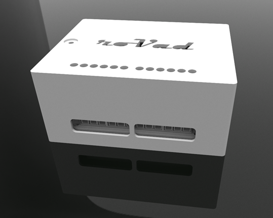

# DIY roVad Smart Switch KIT - 4CH

*Build it. Control it. Enjoy it.*

## Intro

The **DIY roVad Smart Switch Kit** is a DIY electronics kit for smart home experimentation. 
It allows remote or local control of appliances such as lights, LED strips, garage doors, alarms, sensors, home and industrial appliances and more.  

The kit is compatible with platforms such as Home Assistant, Adafruit, CloudAMQP, and Mosquitto, making it easy to integrate into existing smart home setups.

⚠️ **Note:** This is a DIY kit, not a finished consumer product. Assembly is required, and safety precautions must be followed when connecting to mains electricity. 

## 🎥 Promo video

https://youtu.be/JV2t9e-rjnw

## Kit Specifications

- **Enclosure (Box + Lid)**
  - Material: PLA
  - Dimensions: 80 × 96 × 40 mm
- **NodeMCU V3 ESP8266 Wi-Fi Module**
  - Microcontroller: 5V (via micro USB)
  - Wi-Fi: IEEE 802.11 b/g/n (2.4GHz only)
- **Relay Board 4ch**
  - **Input:**  
    - VCC: Positive supply voltage (5V)  
    - GND: Ground  
    - IN1–IN4: Relay control port  
  - **Output:**  
    - Connect a load: DC 30V/10A, AC 250V/10A
- **Dupont F-F cables (10cm) – (Mirocontroller - Relay Board)**
- **LED diode (5mm)**
- **Screws (M3) – 9 pcs**
- **Operating Conditions:**  
  - Humidity ≤ 90%  
  - Temperature: 0°C to 40°C
- **Mobile App:** roVad Smart

## Features

- **4 independent relay channels**

- **AP Mode (offline, local control)**

- **Wi-Fi Mode (remote control via MQTT)**

- **LED indicator** for mode and status

- **Relay timers** for automated switching

- **Two-way Interactive Communication**  
  - Send commands via MQTT or the ROVAD Smart App on your phone.
  - The NodeMCU microcontroller responds **immediately** with real-time status or data.
  - You can request information such as:
    - Current relay states
    - Timer settings
    - Exact device time
  - This enables full interactive control and feedback, making the system more responsive and intuitive.

- **Compatible with ROVAD Smart Android App** for dashboard control

- **Suitable for hobbyists, makers, students, and developers**

## Safety Notice

- High-voltage AC (110–250V) can be switched. Take extreme caution.
- Always disconnect power before assembly, wiring changes, or maintenance.
- Manufacturer is not responsible for damages due to misuse or improper assembly.
- If you are not experienced with electrical wiring, seek assistance from a qualified technician.

## Getting Started

For **detailed assembly instructions, wiring diagrams, and setup**, see [ASSEMBLY.md](ASSEMBLY.md)

## Commands (for MQTT / App)
- Relay 1: `1_ON` / `1_OFF`
- Relay 2: `2_ON` / `2_OFF`
- Relay 3: `3_ON` / `3_OFF`
- Relay 4: `4_ON` / `4_OFF`
- Time request: `timeplease`
- Status check: `status`
- List timers: `listtimer`
- Sequential relay control: `sce_xxxx` (e.g., `sce_1010`)

## About / Roadmap

This project is part of a growing DIY smart home initiative. Future plans include:

- Upgraded kits: 6ch, 8ch, 16ch versions
- Continued roVad Smart App development with interactive elements
- New commands and advanced automation
- Community feedback integration

For more details about the vision and development, see [ABOUT.md](ABOUT.md).

## License & Disclaimer

- DIY educational and development purposes only
- Manufacturer assumes no liability for misuse, damage, or injury
- Follow standard electrical safety practices
